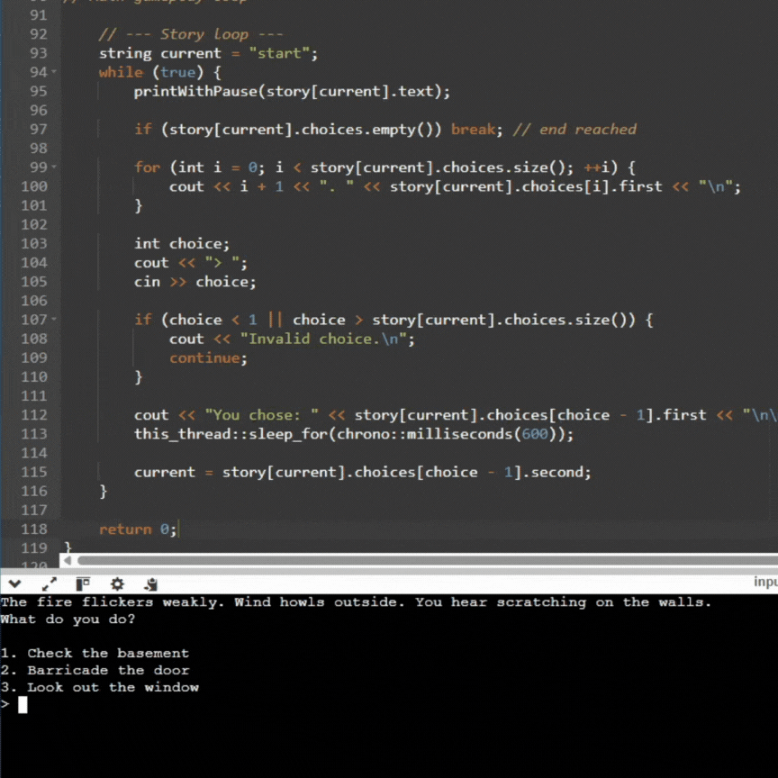

# Commentary

For my narrative game, I used the C++ std::map data structure to manage the overall story flow. A std::map works similarly to a dictionary, storing data as key–value pairs. In my case, each key represents the name of a scene, and the value contains the scene’s narrative text and available player choices. I chose this structure because my story is relatively short and self-contained, making direct lookups by scene name both efficient and easy to manage. Using a map also naturally supports branching narratives, as the player can transition to any scene based on their choices rather than following a strictly linear path.

Player choices are stored using a std::vector of pairs within each scene. Each pair consists of the text shown to the player (the choice itself) and the key of the scene that the choice leads to. This approach allows each scene to define its own set of possible actions while remaining flexible and easy to extend. By keeping choices local to each scene, I can easily add, remove, or reorder options without affecting the rest of the narrative structure. All scenes are stored centrally in the map, which allows any scene to be accessed instantly using its string key.

The main gameplay loop operates by tracking the key of the currently active scene. During each iteration, the game retrieves the scene from the map, displays its narrative text and associated choices, and waits for player input. When the player selects an option, the corresponding scene key is read from the vector of choices and becomes the new active scene. This loop continues until the story reaches an ending state.

One of the main challenges I faced was ensuring that all scene keys were consistent and correctly referenced. Since scenes are accessed by string names, small typos could cause errors or missing scenes at runtime. Another challenge was structuring the narrative logic in a way that remained readable and easy to debug as the number of branches increased. However, using clear data structures and keeping responsibilities separated between scenes, choices, and the main loop helped keep the system manageable and scalable.

## Gameplay GIF

